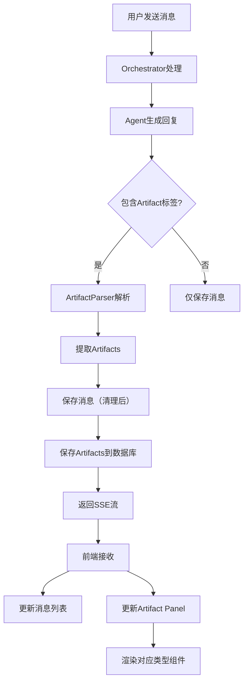

# 🎨 Artifact 系统设计文档

## 📋 概述

Artifact 系统允许智能体生成**可独立展示和操作的结构化内容**，类似于 Claude 的 Artifacts 功能。

### 核心概念

**Artifact** = 聊天中生成的、可在独立面板中展示的结构化内容

---

## 🎯 设计目标

### 支持的场景

| 场景 | Artifact类型 | 展示方式 |
|------|------------|---------|
| 产品方案 | `document` | 富文本文档，支持编辑 |
| 代码实现 | `code` | 语法高亮，可复制/运行 |
| 文章内容 | `markdown` | Markdown渲染 |
| 数据可视化 | `chart` | 图表组件 |
| 网页/应用 | `html` | 预览+编辑 |
| SVG图形 | `svg` | 矢量图展示 |
| 图片 | `image` | 图片预览 |
| 普通对话 | 无 | 仅消息气泡 |

---

## 🏗️ 架构设计

### 1. 数据模型层

```prisma
// Artifact 主表
model SwarmArtifact {
  id          String   @id @default(uuid())
  messageId   String   // 关联的消息ID
  sessionId   String   // 所属会话

  // 内容
  type        ArtifactType    // 类型
  title       String          // 标题
  content     String          // 内容（可能很大）
  language    String?         // 代码语言（code类型）

  // 元数据
  metadata    Json            // 额外元数据
  version     Int             // 版本号

  // 状态
  isPinned    Boolean @default(false)
  isPublished Boolean @default(false)

  createdAt   DateTime @default(now())
  updatedAt   DateTime @updatedAt

  message     SwarmChatMessage @relation(fields: [messageId], references: [id])
  session     SwarmChatSession @relation(fields: [sessionId], references: [id])
}

enum ArtifactType {
  DOCUMENT    // 富文本文档
  CODE        // 代码
  MARKDOWN    // Markdown文档
  HTML        // HTML网页
  SVG         // SVG图形
  CHART       // 图表（JSON配置）
  IMAGE       // 图片
  MERMAID     // Mermaid图表
  REACT       // React组件
}
```

### 2. Agent输出格式

Agent 使用特殊标记输出 Artifact：

```markdown
这是普通对话内容...

<artifact type="code" language="typescript" title="用户认证服务">
```typescript
export class AuthService {
  async login(email: string, password: string) {
    // 实现代码
  }
}
```
</artifact>

这是后续的解释...

<artifact type="document" title="产品需求文档">
# 核心功能

## 1. 用户认证
...
</artifact>
```

### 3. 解析器

```typescript
interface ArtifactMatch {
  type: ArtifactType;
  title: string;
  content: string;
  language?: string;
  startIndex: number;
  endIndex: number;
}

class ArtifactParser {
  // 从消息中提取所有artifacts
  static extractArtifacts(message: string): {
    artifacts: ArtifactMatch[];
    cleanedMessage: string;
  }

  // 验证artifact类型
  static validateType(type: string): boolean

  // 生成artifact ID
  static generateId(sessionId: string, index: number): string
}
```

### 4. 前端组件架构

```
┌─────────────────────────────────────────────────┐
│         Group Chat Interface                    │
├───────────────────────┬─────────────────────────┤
│   Chat Area           │   Artifact Panel        │
│                       │                         │
│  [消息1]              │  ┌──────────────────┐  │
│  [消息2 + 📎]  ────┬─→│  │ CodeArtifact     │  │
│  [消息3]           │  │  │ (语法高亮)       │  │
│                    │  │  └──────────────────┘  │
│                    │  │                         │
│  [消息4 + 📄]  ────┴─→│  ┌──────────────────┐  │
│                       │  │ DocumentArtifact │  │
│                       │  │ (富文本)         │  │
│                       │  └──────────────────┘  │
└───────────────────────┴─────────────────────────┘
```

---

## 🔧 实现细节

### Phase 1: 数据模型扩展

1. 添加 `SwarmArtifact` 表
2. 在 `SwarmChatMessage` 添加关系
3. 运行 migration

### Phase 2: 后端解析

```typescript
// API: POST /api/group-chat
async function processAgentResponse(response: string) {
  // 1. 解析artifacts
  const { artifacts, cleanedMessage } = ArtifactParser.extractArtifacts(response);

  // 2. 保存消息
  const message = await prisma.swarmChatMessage.create({
    data: {
      content: cleanedMessage,
      hasArtifacts: artifacts.length > 0,
    }
  });

  // 3. 保存artifacts
  for (const artifact of artifacts) {
    await prisma.swarmArtifact.create({
      data: {
        messageId: message.id,
        sessionId: message.sessionId,
        type: artifact.type,
        title: artifact.title,
        content: artifact.content,
        language: artifact.language,
        version: 1,
      }
    });
  }

  return { message, artifacts };
}
```

### Phase 3: 前端渲染

```typescript
// ArtifactPanel.tsx
function ArtifactPanel({ sessionId }) {
  const [artifacts, setArtifacts] = useState([]);
  const [activeArtifact, setActiveArtifact] = useState(null);

  // 加载artifacts
  useEffect(() => {
    fetchArtifacts(sessionId);
  }, [sessionId]);

  return (
    <div className="artifact-panel">
      {/* Artifact列表 */}
      <ArtifactList
        artifacts={artifacts}
        onSelect={setActiveArtifact}
      />

      {/* Artifact渲染器 */}
      {activeArtifact && (
        <ArtifactRenderer artifact={activeArtifact} />
      )}
    </div>
  );
}

// ArtifactRenderer.tsx
function ArtifactRenderer({ artifact }) {
  switch (artifact.type) {
    case 'CODE':
      return <CodeArtifact artifact={artifact} />;
    case 'DOCUMENT':
      return <DocumentArtifact artifact={artifact} />;
    case 'MARKDOWN':
      return <MarkdownArtifact artifact={artifact} />;
    case 'CHART':
      return <ChartArtifact artifact={artifact} />;
    // ...
  }
}
```

---

## 💡 Agent提示词配置

在 Agent 的 system prompt 中添加 Artifact 使用指导：

```typescript
const systemPrompt = `
你是一名产品经理。当需要生成结构化内容时，使用<artifact>标签。

## Artifact使用指南

### 何时使用Artifact：
- 生成完整的文档（PRD、方案等）
- 编写代码示例
- 创建表格、图表
- 生成可编辑的内容

### 不使用Artifact：
- 简单的对话回复
- 列表或要点（除非很长）
- 简短的代码片段

### 格式：
<artifact type="document" title="产品需求文档">
内容...
</artifact>

支持的类型：
- document: 富文本文档
- code: 代码（需指定language="typescript"）
- markdown: Markdown文档
- chart: 图表（JSON配置）
- html: HTML页面
- svg: SVG图形

### 示例：

**生成产品文档**
<artifact type="document" title="用户认证功能PRD">
# 功能概述
...
</artifact>

**生成代码**
<artifact type="code" language="typescript" title="认证服务">
\`\`\`typescript
export class AuthService {
  // 代码
}
\`\`\`
</artifact>
`;
```

---

## 🎨 UI组件设计

### ArtifactPanel布局

```typescript
<div className="artifact-panel">
  {/* 头部 */}
  <div className="panel-header">
    <h3>Artifacts ({artifacts.length})</h3>
    <Button onClick={handleExportAll}>导出全部</Button>
  </div>

  {/* Artifact列表（左侧或顶部）*/}
  <div className="artifact-list">
    {artifacts.map(artifact => (
      <ArtifactCard
        key={artifact.id}
        artifact={artifact}
        isActive={activeId === artifact.id}
        onClick={() => setActiveId(artifact.id)}
      />
    ))}
  </div>

  {/* 主内容区 */}
  <div className="artifact-content">
    {activeArtifact ? (
      <ArtifactRenderer artifact={activeArtifact} />
    ) : (
      <EmptyState />
    )}
  </div>
</div>
```

### ArtifactCard

```typescript
function ArtifactCard({ artifact, isActive, onClick }) {
  const icon = getArtifactIcon(artifact.type);

  return (
    <div
      className={`artifact-card ${isActive ? 'active' : ''}`}
      onClick={onClick}
    >
      <div className="card-header">
        <span className="icon">{icon}</span>
        <span className="type">{artifact.type}</span>
      </div>
      <h4 className="title">{artifact.title}</h4>
      <div className="meta">
        <span>{formatDate(artifact.createdAt)}</span>
        <span>{artifact.version}版</span>
      </div>
    </div>
  );
}
```

---

## 🔌 Artifact类型实现

### 1. CodeArtifact

```typescript
function CodeArtifact({ artifact }) {
  return (
    <div className="code-artifact">
      <div className="toolbar">
        <span className="language">{artifact.language}</span>
        <Button onClick={handleCopy}>复制</Button>
        <Button onClick={handleDownload}>下载</Button>
      </div>

      <SyntaxHighlighter
        language={artifact.language}
        style={vscDarkPlus}
      >
        {artifact.content}
      </SyntaxHighlighter>
    </div>
  );
}
```

### 2. DocumentArtifact

```typescript
function DocumentArtifact({ artifact }) {
  const [isEditing, setIsEditing] = useState(false);
  const [content, setContent] = useState(artifact.content);

  return (
    <div className="document-artifact">
      <div className="toolbar">
        <Button onClick={() => setIsEditing(!isEditing)}>
          {isEditing ? '预览' : '编辑'}
        </Button>
        <Button onClick={handleSave}>保存</Button>
        <Button onClick={handleExport}>导出为PDF</Button>
      </div>

      {isEditing ? (
        <RichTextEditor
          value={content}
          onChange={setContent}
        />
      ) : (
        <RichTextViewer content={content} />
      )}
    </div>
  );
}
```

### 3. ChartArtifact

```typescript
function ChartArtifact({ artifact }) {
  const chartConfig = JSON.parse(artifact.content);

  return (
    <div className="chart-artifact">
      <div className="toolbar">
        <Button onClick={handleExport}>导出图片</Button>
        <Button onClick={handleEditData}>编辑数据</Button>
      </div>

      <ResponsiveContainer width="100%" height={400}>
        <BarChart data={chartConfig.data}>
          <CartesianGrid strokeDasharray="3 3" />
          <XAxis dataKey="name" />
          <YAxis />
          <Tooltip />
          <Bar dataKey="value" fill="#8884d8" />
        </BarChart>
      </ResponsiveContainer>
    </div>
  );
}
```

---

## 📊 流程图

### Agent生成Artifact的完整流程



---

## 🚀 实现路线图

### Phase 1: 基础架构 (1-2天)
- [x] 设计数据模型
- [ ] 添加 SwarmArtifact 表
- [ ] 实现 ArtifactParser
- [ ] 更新 API 支持解析

### Phase 2: 基础UI (2-3天)
- [ ] ArtifactPanel 基础布局
- [ ] ArtifactList 组件
- [ ] ArtifactRenderer 路由
- [ ] CodeArtifact 实现

### Phase 3: 扩展类型 (3-4天)
- [ ] DocumentArtifact
- [ ] MarkdownArtifact
- [ ] ChartArtifact
- [ ] HTMLArtifact

### Phase 4: 高级功能 (2-3天)
- [ ] 版本管理
- [ ] 编辑和保存
- [ ] 导出功能
- [ ] 钉选和组织

### Phase 5: Agent集成 (1-2天)
- [ ] 更新 Agent System Prompts
- [ ] 测试各种场景
- [ ] 优化生成质量

---

## 📝 使用示例

### 场景1: 产品需求讨论

**用户**: @产品经理 @技术架构师 我们要做一个用户认证功能

**产品经理回复**:
```
我来输出一份PRD文档：

<artifact type="document" title="用户认证功能PRD v1.0">
# 用户认证功能需求文档

## 1. 功能概述
实现基于邮箱密码的用户认证系统...

## 2. 核心功能
- 用户注册
- 用户登录
- 密码重置
...
</artifact>

这个PRD涵盖了核心流程，请技术架构师评估可行性。
```

**技术架构师回复**:
```
我提供一个技术方案和示例代码：

<artifact type="code" language="typescript" title="认证服务实现">
\`\`\`typescript
import bcrypt from 'bcrypt';
import jwt from 'jsonwebtoken';

export class AuthService {
  async register(email: string, password: string) {
    const hashedPassword = await bcrypt.hash(password, 10);
    // ...
  }

  async login(email: string, password: string) {
    // ...
    return jwt.sign({ userId }, SECRET);
  }
}
\`\`\`
</artifact>

技术栈建议使用JWT + bcrypt，数据库用PostgreSQL存储。
```

**展示效果**:
- 聊天区显示对话
- 右侧Panel显示2个Artifacts
  1. 📄 产品需求文档（可编辑）
  2. 💻 认证服务代码（可复制）

### 场景2: 数据分析

**用户**: 分析一下我们的用户增长

**数据科学家回复**:
```
基于过去6个月的数据，我生成了增长趋势图：

<artifact type="chart" title="用户增长趋势">
{
  "type": "line",
  "data": {
    "labels": ["1月", "2月", "3月", "4月", "5月", "6月"],
    "datasets": [{
      "label": "新增用户",
      "data": [120, 190, 230, 280, 350, 420]
    }]
  }
}
</artifact>

从数据可以看出，用户增长呈加速趋势...
```

**展示效果**:
- 聊天区显示分析文字
- Artifact Panel显示可交互的图表

---

## 🎯 优势总结

### 对比传统消息展示

| 方面 | 传统方式 | Artifact系统 |
|------|---------|-------------|
| 长内容 | 消息列表冗长 | 独立面板展示 |
| 代码 | 普通文本 | 语法高亮+复制 |
| 文档 | Markdown | 富文本编辑器 |
| 可编辑性 | 不支持 | 支持编辑和版本 |
| 复用性 | 难以查找 | 独立管理和导出 |
| 多类型 | 混杂显示 | 分类清晰 |

### 核心价值

1. **更好的内容组织** - 结构化内容独立展示
2. **提升可操作性** - 可编辑、下载、复制
3. **支持多种格式** - 代码、文档、图表等
4. **版本管理** - 可追踪内容演进
5. **提升协作效率** - 清晰的输出和交付物

---

这个设计既保持了聊天的连贯性，又能优雅地展示和管理各种类型的结构化输出！
