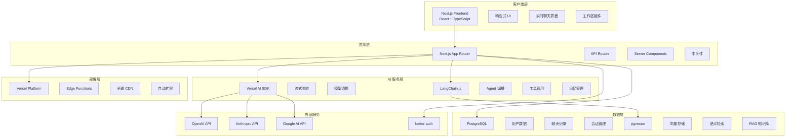

# SwarmAI.chat 技术栈文档

## 📋 文档信息

**文档版本**: V1.0  
**更新时间**: 2025 年 6 月  
**适用版本**: SwarmAI.chat V1.0  
**维护团队**: 技术架构组

---

## 🎯 技术栈概览

SwarmAI.chat 采用现代化的全栈技术架构，专为 **多智能体 AI 协作平台** 设计，确保高性能、可扩展性和开发效率。

### 核心设计原则

- **性能优先**: 支持实时 AI 流式响应，<2 秒延迟
- **可扩展性**: 支持多智能体并发协作
- **开发效率**: 统一技术栈，降低维护成本
- **现代化**: 采用最新稳定版本的主流技术

---

## 🏗️ V1.0 技术栈选型

### 🌐 全栈框架
**Next.js 15 (TypeScript)**
- **版本**: 15.3.4+
- **特性**: App Router, Server Components, Streaming
- **用途**: 统一前后端开发，SSR/SSG 优化 SEO

### ☁️ 部署平台
**Vercel**
- **优势**: 与 Next.js 原生集成，零配置部署
- **特性**: Edge Functions, 全球 CDN, 自动扩容
- **用途**: 生产环境部署和托管

### 🗄️ 数据库系统
**PostgreSQL + pgvector**
- **托管平台**: Supabase 或 Neon
- **核心扩展**: pgvector (向量数据库)
- **用途**: 用户数据、聊天记录、向量检索 (RAG)

### 🤖 AI/LLM 集成
**Vercel AI SDK + LangChain.js**
- **Vercel AI SDK**: 统一 AI 模型接口，流式响应
- **LangChain.js**: 构建复杂 Agent 逻辑和工作流
- **支持模型**: OpenAI GPT-4, Anthropic Claude, Google Gemini

### 🔐 用户认证
**better-auth**
- **特性**: 现代化认证解决方案
- **支持**: OAuth, 邮箱登录，社交登录
- **集成**: 与 Next.js 深度集成

---

## 🏛️ 系统架构图



---

## 🔧 详细技术选型

### 1. 前端技术栈

#### Next.js 15 (App Router)
```typescript
// 项目配置
const nextConfig = {
  experimental: {
    serverComponentsExternalPackages: ['langchain']
  },
  env: {
    CUSTOM_KEY: process.env.CUSTOM_KEY,
  }
}
```

**选择理由**:
- ✅ 统一前后端开发体验
- ✅ 内置 SSR/SSG 优化 SEO
- ✅ Server Components 减少客户端包大小
- ✅ 与 Vercel 完美集成

#### TypeScript 严格模式
```json
{
  "compilerOptions": {
    "strict": true,
    "noImplicitAny": true,
    "strictNullChecks": true
  }
}
```

### 2. AI 服务集成

#### Vercel AI SDK
```typescript
import { openai } from '@ai-sdk/openai'
import { streamText } from 'ai'

// 流式 AI 响应
export async function POST(req: Request) {
  const { messages } = await req.json()
  
  const result = await streamText({
    model: openai('gpt-4'),
    messages,
  })
  
  return result.toAIStreamResponse()
}
```

**功能特性**:
- 🔄 多模型统一接口 (OpenAI, Anthropic, Google)
- 📡 原生流式响应支持
- 🎯 React Hooks 集成 (`useChat`, `useCompletion`)
- ⚡ 自动错误处理和重试

#### LangChain.js
```typescript
import { ChatOpenAI } from '@langchain/openai'
import { AgentExecutor, createOpenAIFunctionsAgent } from 'langchain/agents'

// Agent 工作流
const agent = await createOpenAIFunctionsAgent({
  llm: new ChatOpenAI(),
  tools: [summarizeTool, analysisTool],
  prompt: agentPrompt
})

const agentExecutor = new AgentExecutor({
  agent,
  tools: [summarizeTool, analysisTool],
})
```

**应用场景**:
- 🤖 多智能体协作编排
- 🔧 工具调用和函数绑定
- 🧠 长期记忆和上下文管理
- 📋 复杂工作流设计

### 3. 数据存储方案

#### PostgreSQL + pgvector
```sql
-- 创建向量表
CREATE TABLE documents (
  id SERIAL PRIMARY KEY,
  content TEXT,
  embedding VECTOR(1536),
  metadata JSONB
);

-- 创建向量索引
CREATE INDEX ON documents USING ivfflat (embedding vector_cosine_ops);

-- 语义检索查询
SELECT content, 1 - (embedding <=> $1) as similarity
FROM documents
ORDER BY embedding <=> $1
LIMIT 5;
```

**技术优势**:
- 📊 结构化数据存储 (用户、聊天、会话)
- 🔍 向量语义检索 (RAG 知识库)
- 🚀 高性能查询和索引
- 🔒 ACID 事务保证

#### Supabase vs Neon 对比

| 特性 | Supabase | Neon |
|------|----------|------|
| **PostgreSQL 版本** | 15+ | 16+ |
| **pgvector 支持** | ✅ 原生支持 | ✅ 原生支持 |
| **实时订阅** | ✅ Realtime | ❌ 无 |
| **边缘函数** | ✅ Edge Functions | ✅ Neon Functions |
| **自动扩容** | ⚡ 手动 | ⚡ 自动无服务器 |
| **价格优势** | 💰 中等 | 💰 按需付费 |
| **推荐场景** | 快速原型开发 | 生产环境部署 |

### 4. 用户认证系统

#### better-auth 配置
```typescript
import { betterAuth } from "better-auth"
import { prismaAdapter } from "better-auth/adapters/prisma"

export const auth = betterAuth({
  database: prismaAdapter(db),
  socialProviders: {
    github: {
      clientId: process.env.GITHUB_CLIENT_ID!,
      clientSecret: process.env.GITHUB_CLIENT_SECRET!,
    },
    google: {
      clientId: process.env.GOOGLE_CLIENT_ID!,
      clientSecret: process.env.GOOGLE_CLIENT_SECRET!,
    }
  }
})
```

**功能特性**:
- 🔐 多种登录方式 (邮箱、GitHub、Google)
- 🛡️ JWT + Session 双重认证
- 🔄 自动 Token 刷新
- 🎯 与 Next.js 深度集成

---

## 📦 核心依赖包

### 生产依赖
```json
{
  "dependencies": {
    // 框架核心
    "next": "^15.3.4",
    "react": "^18.3.1",
    "typescript": "^5.0.0",
    
    // AI 集成
    "ai": "^3.0.0",
    "@ai-sdk/openai": "^0.0.50",
    "langchain": "^0.2.0",
    "@langchain/openai": "^0.2.0",
    
    // 数据库
    "@supabase/supabase-js": "^2.39.0",
    "drizzle-orm": "^0.30.0",
    "postgres": "^3.4.0",
    
    // 认证
    "better-auth": "^0.5.0",
    
    // UI 组件
    "next-themes": "^0.3.0",
    "framer-motion": "^11.0.0"
  }
}
```

### 开发依赖
```json
{
  "devDependencies": {
    "@types/node": "^20.0.0",
    "@types/react": "^18.3.0",
    "eslint": "^8.57.0",
    "eslint-config-next": "^15.3.4",
    "tailwindcss": "^3.4.0",
    "drizzle-kit": "^0.21.0"
  }
}
```

---

## 🚀 部署架构

### Vercel 部署配置
```json
{
  "version": 2,
  "builds": [
    {
      "src": "package.json",
      "use": "@vercel/next"
    }
  ],
  "env": {
    "DATABASE_URL": "@database-url",
    "OPENAI_API_KEY": "@openai-key",
    "NEXTAUTH_SECRET": "@auth-secret"
  },
  "functions": {
    "app/api/**": {
      "maxDuration": 30
    }
  }
}
```

### 环境变量配置
```env
# 数据库
DATABASE_URL="postgresql://..."
DATABASE_DIRECT_URL="postgresql://..."

# AI 服务
OPENAI_API_KEY="sk-..."
ANTHROPIC_API_KEY="sk-ant-..."
GOOGLE_API_KEY="..."

# 认证
BETTER_AUTH_SECRET="your-secret-key"
BETTER_AUTH_URL="https://your-domain.com"

# GitHub OAuth
GITHUB_CLIENT_ID="..."
GITHUB_CLIENT_SECRET="..."

# Google OAuth
GOOGLE_CLIENT_ID="..."
GOOGLE_CLIENT_SECRET="..."
```

---

## 📊 性能优化策略

### 1. 前端优化
- **代码分割**: 动态导入非关键组件
- **图片优化**: Next.js Image 组件 + WebP
- **缓存策略**: SWR 数据获取 + Redis 缓存
- **Bundle 分析**: webpack-bundle-analyzer

### 2. 后端优化
- **数据库**: 索引优化 + 连接池
- **API 路由**: Edge Runtime + 流式响应
- **CDN 缓存**: Vercel 全球边缘节点

### 3. AI 服务优化
- **模型选择**: 根据任务复杂度选择合适模型
- **并发控制**: 限制同时 AI 请求数量
- **缓存机制**: 相似问题结果缓存

---

## 🔒 安全考虑

### 1. 数据安全
- **加密存储**: 数据库连接 SSL + 敏感数据加密
- **访问控制**: 行级安全策略 (RLS)
- **备份策略**: 自动备份 + 多地域容灾

### 2. API 安全
- **认证授权**: JWT Token + API Key
- **请求限制**: Rate Limiting + DDoS 防护
- **输入验证**: Zod 数据验证

### 3. AI 安全
- **内容过滤**: 敏感内容检测和过滤
- **成本控制**: API 调用限额和监控
- **隐私保护**: 用户数据匿名化处理

---

## 📋 实施计划

### Phase 1: 基础架构 (2 周)
- [x] Next.js 15 项目搭建
- [x] TypeScript 配置
- [x] 基础 UI 组件
- [ ] PostgreSQL + pgvector 部署
- [ ] better-auth 集成

### Phase 2: AI 集成 (3 周)
- [ ] Vercel AI SDK 集成
- [ ] LangChain.js Agent 开发
- [ ] 多模型支持
- [ ] 流式响应优化

### Phase 3: 功能完善 (3 周)
- [ ] 用户认证系统
- [ ] 聊天数据持久化
- [ ] RAG 知识库
- [ ] 工作区功能

### Phase 4: 优化部署 (2 周)
- [ ] 性能优化
- [ ] 安全加固
- [ ] 监控告警
- [ ] 生产环境部署

---

## 🧪 测试策略

### 单元测试
```typescript
// Jest + React Testing Library
import { render, screen } from '@testing-library/react'
import ChatArea from '../ChatArea'

test('renders chat messages', () => {
  render(<ChatArea messages={mockMessages} />)
  expect(screen.getByText('Hello, AI!')).toBeInTheDocument()
})
```

### 集成测试
```typescript
// API 路由测试
import { POST } from '../app/api/chat/route'

test('AI chat API responds correctly', async () => {
  const response = await POST(new Request('http://localhost', {
    method: 'POST',
    body: JSON.stringify({ messages: [{ role: 'user', content: 'Hello' }] })
  }))
  
  expect(response.status).toBe(200)
})
```

### E2E 测试
```typescript
// Playwright 端到端测试
import { test, expect } from '@playwright/test'

test('user can send message and receive AI response', async ({ page }) => {
  await page.goto('/')
  await page.fill('[data-testid=message-input]', 'Hello AI')
  await page.click('[data-testid=send-button]')
  
  await expect(page.locator('[data-testid=ai-response]')).toBeVisible()
})
```

---

## 📈 监控和分析

### 1. 性能监控
- **Vercel Analytics**: 页面性能和用户行为
- **Sentry**: 错误跟踪和性能监控
- **DataDog**: 后端服务监控

### 2. 业务指标
- **AI 响应时间**: P50, P95, P99 延迟
- **用户活跃度**: DAU, MAU, 留存率
- **功能使用率**: 群聊创建、工具使用

### 3. 成本优化
- **AI API 成本**: Token 使用量监控
- **数据库成本**: 查询优化和容量规划
- **部署成本**: Vercel 使用量分析

---

## 🔄 技术演进路线

### V1.1 规划 (Q3 2025)
- **移动端**: React Native 或 PWA 增强
- **实时协作**: WebSocket + 多用户协作
- **插件系统**: 第三方工具集成

### V2.0 规划 (Q4 2025)
- **私有部署**: Docker + Kubernetes
- **企业功能**: SSO + 权限管理
- **高级 AI**: 自定义模型微调

---

## 📚 技术文档参考

### 官方文档
- [Next.js 15 Documentation](https://nextjs.org/docs)
- [Vercel AI SDK](https://sdk.vercel.ai/docs)
- [LangChain.js](https://js.langchain.com/docs/)
- [better-auth](https://www.better-auth.com/docs)
- [Supabase](https://supabase.com/docs) / [Neon](https://neon.tech/docs)

### 最佳实践
- [Next.js Performance](https://nextjs.org/docs/app/building-your-application/optimizing)
- [PostgreSQL Vector Search](https://github.com/pgvector/pgvector)
- [AI Application Security](https://owasp.org/www-project-ai-security-and-privacy-guide/)

---

**文档维护者**: 技术架构组  
**最后更新**: 2025 年 6 月
