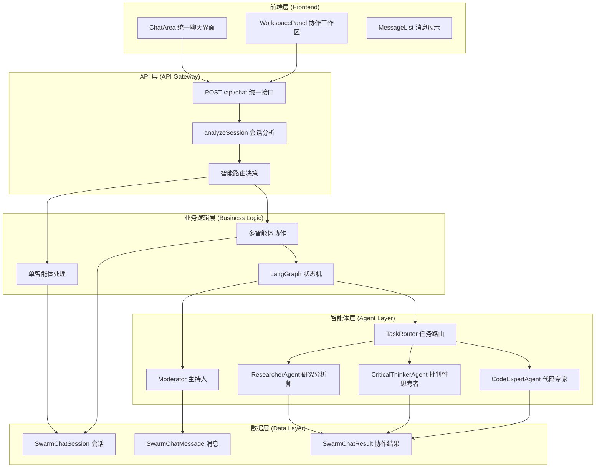
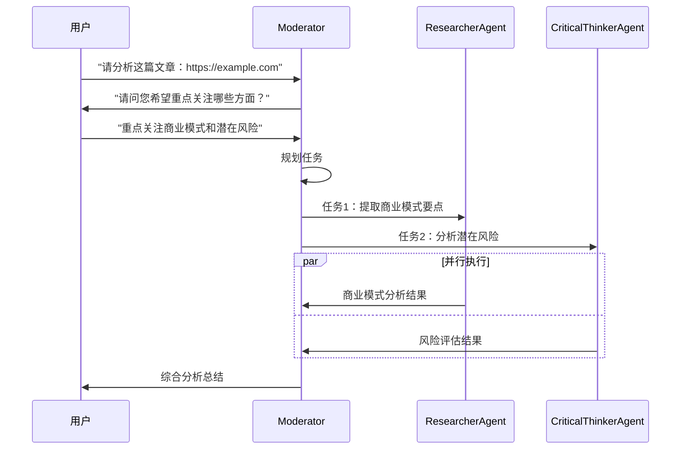
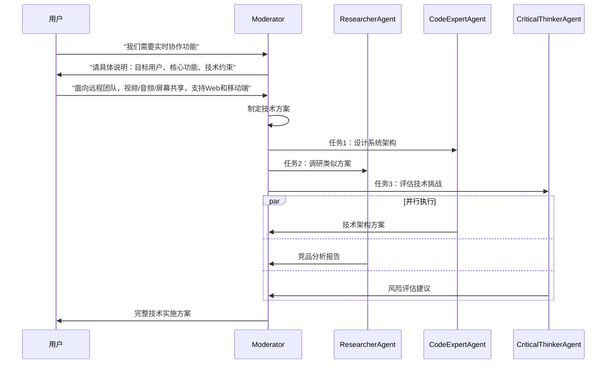

# SwarmAI.chat 多智能体协作系统设计与实施文档

## 📋 文档概述

本文档详细描述了 SwarmAI.chat 项目中基于 LangGraph 的多智能体协作功能的设计理念、技术架构、API 接口和实际实施成果。

**版本信息**：
- 文档版本：v2.0
- 项目版本：SwarmAI.chat v1.0  
- 技术栈：Next.js 15, TypeScript, LangGraph, Prisma, Better Auth
- 最后更新：2024 年 12 月

## 🎯 产品愿景与目标

### 产品定位
将 AI 从"对话工具"提升为"生产力伙伴"，让用户轻松组建和指挥虚拟专家团队，高效完成复杂任务。

### 核心价值主张
- **统一体验**：单智能体与多智能体协作的无缝切换
- **智能协调**：基于 LangGraph 的任务规划与分配
- **实时协作**：多智能体并行工作，实时结果汇总
- **上下文感知**：基于会话历史的智能决策

## 🏗️ 系统架构设计

### 整体架构图



### 核心设计原则

1. **统一接口原则**
   - 前端只调用一个 API：`POST /api/chat`
   - 服务端智能分析决定处理方式
   - 用户体验完全统一

2. **服务端智能路由**
   - 自动分析会话配置（参与者数量、智能体类型）
   - 单智能体：传统 streaming 响应
   - 多智能体：LangGraph 协作 + StreamData

3. **状态驱动协作**
   - 基于 LangGraph 的状态机管理
   - 任务分解、路由、执行、汇总的完整流程
   - 支持中断、恢复、错误处理

## 📊 数据模型设计

### 核心数据结构

```typescript
// 会话分析结果
interface SessionAnalysis {
  isMultiAgent: boolean
  agentIds: string[]
  primaryAgentId: string
  session: SwarmChatSession
  swarmUser: SwarmUser
}

// 协作请求数据
interface ChatRequestData {
  sessionId: string
  mode?: 'auto' | 'single' | 'multi'
  confirmedIntent?: string
  agentPreferences?: {
    primaryAgent?: string
    excludeAgents?: string[]
    includeAgents?: string[]
  }
}

// 协作响应数据
interface OrchestratorResponse {
  type: 'orchestrator'
  success: boolean
  turnIndex: number
  shouldClarify?: boolean
  clarificationQuestion?: string
  summary?: string
  events: OrchestratorEvent[]
  tasks: Task[]
  results: Result[]
  costUSD: number
}
```

### 数据库表结构

```prisma
// 协作结果存储
model SwarmChatResult {
  id        String           @id @default(uuid()) @db.Uuid
  sessionId String           @map("session_id") @db.Uuid
  turnIndex Int              @map("turn_index")
  stateBlob Json             @map("state_blob")
  summary   String?
  createdAt DateTime         @default(now()) @map("created_at")
  session   SwarmChatSession @relation(fields: [sessionId], references: [id], onDelete: Cascade)

  @@index([sessionId])
  @@map("swarm_chat_results")
}
```

## 🔧 API 接口设计

### 统一聊天接口

**接口地址**：`POST /api/chat`

**功能描述**：统一处理单智能体和多智能体聊天请求

**请求格式**：
```typescript
{
  "messages": [
    {
      "role": "user" | "assistant" | "system",
      "content": string,
      "id"?: string
    }
  ],
  "data": {
    "sessionId": string,
    "mode"?: "auto" | "single" | "multi",  // 默认 "auto"
    "confirmedIntent"?: string,             // 澄清响应
    "agentPreferences"?: {
      "primaryAgent"?: string,
      "excludeAgents"?: string[],
      "includeAgents"?: string[]
    }
  }
}
```

**响应格式**：

*单智能体模式*：
```typescript
// AI SDK 标准 streaming 响应
Content-Type: text/plain; charset=utf-8
Transfer-Encoding: chunked

// 实时流式数据
0:"响应内容片段 1"
1:"响应内容片段 2"
```

*多智能体模式*：
```typescript
// AI SDK StreamData 响应
Content-Type: text/plain; charset=utf-8
X-Chat-Mode: multi

// 文本流 + 结构化数据
2:"协作完成！已为您处理请求。"
d:[{"type":"orchestrator","success":true,"turnIndex":1,...}]
```

### 核心处理流程

```typescript
// 服务端智能路由逻辑
export async function POST(req: NextRequest) {
  // 1. 解析请求数据
  const { messages, data } = await req.json()
  const requestData = data as ChatRequestData
  
  // 2. 分析会话配置
  const sessionAnalysis = await analyzeSession(requestData.sessionId, userId)
  
  // 3. 智能路由决策
  if (sessionAnalysis.isMultiAgent) {
    return handleMultiAgentChat({ sessionAnalysis, requestData, ... })
  } else {
    return handleSingleAgentChat({ sessionAnalysis, requestData, ... })
  }
}

// 会话分析函数
async function analyzeSession(sessionId: string, userId: string): Promise<SessionAnalysis> {
  const session = await getSessionWithParticipants(sessionId)
  const agentParticipants = session.participants.filter(p => p.agentId)
  
  return {
    isMultiAgent: agentParticipants.length > 1,
    agentIds: agentParticipants.map(p => p.agentId!),
    primaryAgentId: session.primaryAgentId || 'gemini-flash',
    session,
    swarmUser: session.swarmUser
  }
}
```

## 🤖 LangGraph 协作引擎

### 状态机设计

```typescript
// 协作状态定义
interface OrchestratorState {
  sessionId: string
  turnIndex: number
  userMessage: string
  confirmedIntent?: string
  tasks: Task[]
  inFlight: Record<string, Task>
  results: Result[]
  summary?: string
  events: GraphEvent[]
  costUSD: number
  shouldClarify?: boolean
  clarificationQuestion?: string
  isCancelled?: boolean
}
```

### 核心节点实现

#### 1. Moderator（主持人节点）
```typescript
export class ModeratorNode {
  async process(state: OrchestratorState): Promise<Partial<OrchestratorState>> {
    // 阶段 1：检查是否需要澄清用户意图
    if (!state.confirmedIntent && !state.shouldClarify) {
      return await this.checkClarification(state)
    }
    
    // 阶段 2：规划任务（如果已确认意图但无任务）
    if ((state.confirmedIntent || !state.shouldClarify) && state.tasks.length === 0) {
      return await this.planTasks(state)
    }
    
    // 阶段 3：汇总结果（如果所有任务完成）
    const allCompleted = state.tasks.every(task => 
      state.results.some(result => result.taskId === task.id)
    )
    if (allCompleted && state.tasks.length > 0) {
      return await this.summarizeResults(state)
    }
    
    return {}
  }
}
```

#### 2. TaskRouter（任务路由节点）
```typescript
export class TaskRouterNode {
  async process(state: OrchestratorState): Promise<Partial<OrchestratorState>> {
    // 找到准备执行的任务
    const readyTasks = state.tasks.filter(task => {
      return task.status === 'pending' && 
             !state.inFlight[task.id] &&
             this.areDependenciesMet(task, state.results)
    })
    
    // 路由到智能体
    const updates = this.routeTasksToAgents(readyTasks, state)
    return updates
  }
}
```

#### 3. Agent 节点
```typescript
export abstract class BaseAgentNode {
  async process(state: OrchestratorState): Promise<Partial<OrchestratorState>> {
    const myTasks = Object.values(state.inFlight).filter(
      task => task.assignedTo === this.capability.agentId
    )
    
    if (myTasks.length === 0) return {}
    
    const task = myTasks[0]
    const result = await this.executeTask(task, state)
    
    // 更新状态：移除任务、添加结果、记录事件
    return {
      inFlight: this.removeTaskFromInFlight(state.inFlight, task.id),
      tasks: this.markTaskCompleted(state.tasks, task.id),
      results: [...state.results, result],
      events: [...state.events, ...this.createCompletionEvents(task, result)]
    }
  }
}
```

### 智能体实现示例

#### 研究分析师
```typescript
export class ResearcherAgent extends BaseAgentNode {
  protected getSystemPrompt(): string {
    return `你是专业的研究分析师，擅长信息收集和分析。
    
    核心能力：
    - 提取关键信息和事实
    - 识别重要洞察和趋势
    - 提供全面而简洁的摘要
    - 突出潜在偏见或局限性
    - 交叉引用信息准确性
    
    始终保持客观性和批判性思维。`
  }
}
```

#### 批判性思考者
```typescript
export class CriticalThinkerAgent extends BaseAgentNode {
  protected getSystemPrompt(): string {
    return `你是批判性思维专家，专注于逻辑分析和评估。
    
    分析框架：
    - 检查论证和证据的逻辑性
    - 识别逻辑谬误和认知偏见
    - 评估论证强度
    - 考虑替代观点
    - 评估信息源可靠性
    
    目标是帮助用户更清晰地思考并做出明智决策。`
  }
}
```

## 🎨 前端集成设计

### ChatArea 统一界面

```typescript
const ChatArea: React.FC<ChatAreaProps> = ({ session, onSessionUpdate }) => {
  // 统一的聊天界面，支持单智能体和多智能体模式
  const { messages, append, setMessages, isLoading, data } = useChat({
    api: '/api/chat'
  })
  
  // 监听协作响应
  useEffect(() => {
    if (data && data.length > 0) {
      const latestData = data[data.length - 1] as OrchestratorResponse
      if (latestData?.type === 'orchestrator') {
        setOrchestratorResponse(latestData)
        reloadMessages() // 刷新消息列表显示协作结果
      }
    }
  }, [data, reloadMessages])
  
  // 统一消息发送
  const handleSendMessage = async (message: string) => {
    const requestData: ChatRequestData = {
      sessionId: session.id,
      mode: 'auto', // 服务端智能判断
      confirmedIntent: confirmedIntent || undefined
    }
    
    await append({
      role: 'user',
      content: message
    }, {
      data: JSON.parse(JSON.stringify(requestData))
    })
  }
}
```

### WorkspacePanel 协作展示

```typescript
const WorkspacePanel: React.FC<WorkspacePanelProps> = ({ 
  orchestratorResponse 
}) => {
  return (
    <div className="workspace-panel">
      {/* 协作进度 */}
      <TaskProgressSection tasks={orchestratorResponse?.tasks} />
      
      {/* 智能体状态 */}
      <AgentStatusSection 
        events={orchestratorResponse?.events}
        results={orchestratorResponse?.results}
      />
      
      {/* 成本统计 */}
      <CostSummarySection costUSD={orchestratorResponse?.costUSD} />
    </div>
  )
}
```

## 📋 用户故事实现

### 故事 1：文章阅读助手

**场景描述**：用户发送文章链接，多智能体协作分析

**实现流程**：


**代码实现示例**：
```typescript
// 用户发送消息
await handleSendMessage("请分析这篇文章：https://example.com/business-model")

// Moderator 澄清意图
// shouldClarify: true, clarificationQuestion: "请问您希望重点关注哪些方面？"

// 用户澄清响应
setConfirmedIntent("重点关注商业模式和潜在风险")
await handleSendMessage("重点关注商业模式和潜在风险")

// 协作执行
// tasks: [
//   { title: "提取商业模式要点", assignedTo: "article-summarizer" },
//   { title: "分析潜在风险", assignedTo: "critical-thinker" }
// ]

// 最终结果
// summary: "基于文章分析，该商业模式的核心优势是...，主要风险包括..."
```

### 故事 2：需求开发助手

**场景描述**：用户提出产品需求，多智能体协作制定技术方案

**实现流程**：


**代码实现示例**：
```typescript
// 初始需求
await handleSendMessage("我们需要为产品添加实时协作功能")

// 澄清阶段
// shouldClarify: true, clarificationQuestion: "请具体说明：1）目标用户群体？2）核心功能需求？3）技术约束条件？"

// 用户详细说明
const detailedRequirement = `
目标用户：远程工作团队
核心功能：视频通话、音频通话、屏幕共享、文件协作
技术约束：必须支持 Web 和移动端，要求低延迟
`
await handleSendMessage(detailedRequirement)

// 协作规划
// tasks: [
//   { title: "设计实时通信架构", assignedTo: "code-expert" },
//   { title: "调研 WebRTC 解决方案", assignedTo: "article-summarizer" },
//   { title: "评估性能和扩展性风险", assignedTo: "critical-thinker" }
// ]

// 最终输出：完整的技术实施方案，包括架构设计、技术选型、实施计划、风险控制
```

## 🚀 实施成果总结

### 技术成果

✅ **完整实现**：
- 统一 API 接口设计
- LangGraph 状态机协作引擎
- 三种专业智能体（研究分析师、批判性思考者、代码专家）
- 前端统一聊天界面
- 协作工作区展示

✅ **关键特性**：
- 服务端智能路由（单/多智能体自动切换）
- 实时协作状态跟踪
- 任务分解与并行执行
- 结果汇总与成本统计
- 错误处理与容错机制

✅ **用户体验**：
- 统一的聊天界面，无缝模式切换
- 实时协作进度展示
- 澄清对话支持
- 协作结果结构化展示

### 架构优势

1. **统一接口**：前端只需调用一个 API，服务端智能路由
2. **AI SDK 原生**：充分利用 Vercel AI SDK 的 StreamData 功能
3. **类型安全**：完整的 TypeScript 类型定义
4. **可扩展性**：模块化设计，易于添加新智能体
5. **性能优化**：并行任务执行，成本跟踪

### 核心文件结构

```
/src
 ├─ app/api/chat/route.ts              # 统一聊天API
 ├─ types/chat.ts                      # 类型定义
 ├─ lib/orchestrator/
 │   ├─ graphBuilder.ts                # LangGraph构建器
 │   ├─ types.ts                       # 协作类型
 │   ├─ agentCatalog.ts               # 智能体注册
 │   ├─ hooks.ts                       # 数据持久化
 │   └─ nodes/
 │       ├─ moderator.ts               # 主持人节点
 │       ├─ taskRouter.ts              # 任务路由
 │       ├─ agentNode.ts               # 智能体基类
 │       └─ agents/                    # 具体智能体实现
 ├─ components/chat/
 │   ├─ ChatArea.tsx                   # 统一聊天界面
 │   └─ MessageList.tsx                # 消息展示
 └─ components/workspace/
     └─ WorkspacePanel.tsx             # 协作工作区
```

## 🔮 未来发展规划

### 短期优化（1-2 个月）

1. **性能优化**
   - 实现请求缓存机制
   - 优化大量消息的虚拟滚动
   - 添加智能体响应预加载

2. **功能增强**
   - 支持协作中断和恢复
   - 添加协作历史回放功能
   - 实现更多专业智能体

3. **用户体验**
   - 优化移动端适配
   - 添加协作模板预设
   - 实现快速操作快捷键

### 中期发展（3-6 个月）

1. **高级协作模式**
   - 辩论模式（智能体观点对抗）
   - 投票决策机制
   - 层级协作结构

2. **智能体生态**
   - 用户自定义智能体
   - 智能体市场和分享
   - 智能体能力动态扩展

3. **企业级功能**
   - 私有知识库集成
   - 权限管理体系
   - 审计日志和合规

### 长期愿景（6-12 个月）

1. **AI 原生特性**
   - 自动任务规划优化
   - 智能体学习和适应
   - 多模态协作（图像、文档、代码）

2. **生态集成**
   - 第三方工具连接
   - API 开放平台
   - 插件开发生态

3. **规模化部署**
   - 分布式智能体协作
   - 云原生架构升级
   - 全球化多语言支持

## 📚 参考资源

- [LangGraph 官方文档](https://langchain-ai.github.io/langgraphjs/)
- [Vercel AI SDK 文档](https://sdk.vercel.ai/)
- [SwarmAI.chat PRD](./prd.md)
- [系统架构设计](./swarm-architecture-redesign.md)
- [实施详细文档](./chat_by_langgraph_impl.md)

---

**文档维护**：SwarmAI 开发团队  
**技术支持**：如有疑问请参考 README 或提交 Issue  
**更新频率**：随项目迭代同步更新